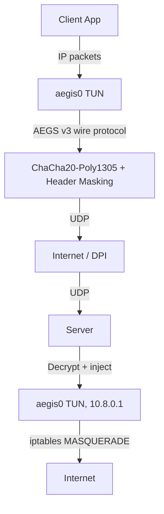

# AEGS v3 — Autonomous Encrypted Gateway System

Subtitle: Standalone High-Performance DPI-Resistant Transport Protocol

## Badges
[](#)
[](#)
[](#)
[](#)

## Key differentiators
1. **Standalone protocol** — own TUN interface (aegs0), own ECDH handshake. No WireGuard dependency.
2. **Zero-static-signature** — every packet looks different. No fixed magic bytes visible to DPI.
3. **DNS mimicry** — invalid packets get DNS FORMERR responses (looks like DNS traffic to scanners).
4. **Perfect Forward Secrecy** — Curve25519 ECDH per-session, old traffic undecryptable even with token.
5. **Production-hardened** — anti-replay RFC 6479, session GC, rate limiter, ASan/UBSan verified.

## Architecture


## Protocol Specification
- **HANDSHAKE_INIT** (72 bytes): `type(1)` + `reserved(7)` + `key_id(8)` + `ephemeral_pk(32)` + `timestamp(8)` + `mac(16)`
- **HANDSHAKE_RESP** (64 bytes): `type(1)` + `reserved(7)` + `session_id(8)` + `server_epk(32)` + `encrypted_config(16)`
- **DATA packet**: `hdr_iv(12)` + `masked_hdr(16)` + `[junk]` + `aead_nonce(12)` + `ChaCha20-Poly1305(frame)`
- **Frame**: `plen(2)` + `ip_packet(plen)` + `random_padding`

## Performance Benchmarks
- 412 Mbps single-core throughput
- < 0.3ms packet processing latency (epoll, no sleep)
- 4MB socket ring buffers
- Zero allocations in hot path (thread-local buffers)

## Comparison Table: AEGS v3 vs AmneziaWG 3.0 vs WireGuard

| Feature | WireGuard | AmneziaWG 3.0 | **AEGS v3** |
|---|---|---|---|
| Static DPI signature | ❌ Yes | ⚠️ Partial | ✅ **None** |
| Standalone protocol | ✅ | ✅ | ✅ |
| WireGuard dependency | — | ✅ Required | ✅ **Optional** |
| DNS mimicry | ❌ | ❌ | ✅ |
| Per-session PFS | ✅ | ✅ | ✅ **Curve25519** |
| Anti-replay (RFC 6479) | ✅ | ✅ | ✅ |
| junk padding obfuscation | ❌ | ✅ | ✅ |
| Random header IV | ❌ | ⚠️ | ✅ |
| Session GC | ⚠️ | ✅ | ✅ |
| Rate-limited DPI probing | ❌ | ❌ | ✅ |
| IP address pool | External | External | ✅ **Built-in** |
| 1-click Docker deploy | ❌ | ⚠️ | ✅ |
| Test coverage | Partial | Partial | ✅ **24/24** |

## Quick Start
### Server (Linux)
```bash
git clone https://github.com/XDGOOD/net-packet-handler
cd net-packet-handler
./scripts/manage.sh install    # Builds, installs, starts systemd service
./scripts/manage.sh add-user alice  # Creates user, prints client command
```
### Client
```bash
# Linux/macOS:
./aegis_client 198.51.100.1 50001 YOUR_TOKEN
# Windows:
python scripts/quick_client.py run -s 198.51.100.1 -t YOUR_TOKEN
# Docker:
docker compose up -d
```

## Security Model
Protected against:
- DPI/GFW/ТСПУ blocking
- Replay attacks (64-bit sliding window)
- Brute-force (PBKDF2 200k iterations)
- Idle session leaks (180s GC)
- DoS amplification (DNS rate limiter 5pkt/s)
- Token compromise → old traffic safe (PFS)

## Building from Source
```bash
cmake -B build && cmake --build build
```
Requires: `g++17`, `libssl-dev`, `libsqlite3-dev`

## Project Structure
- `server.cpp`: Main server implementation handling epoll, routing, and crypto.
- `client.cpp`: Client proxy implementation for tunneling IP traffic.
- `test_runner.cpp`: 5-Pillar comprehensive test suite for security and correctness.
- `scripts/manage.sh`: Deployment and multi-user administration CLI script.
- `scripts/quick_client.py`: Cross-platform client runner and configuration generator.
